## Изучите [README.md](README.md) файл и структуру проекта.

## Задание 1

[ca-container](diagrams/ca-container.puml)

## Задание 2

### Tests

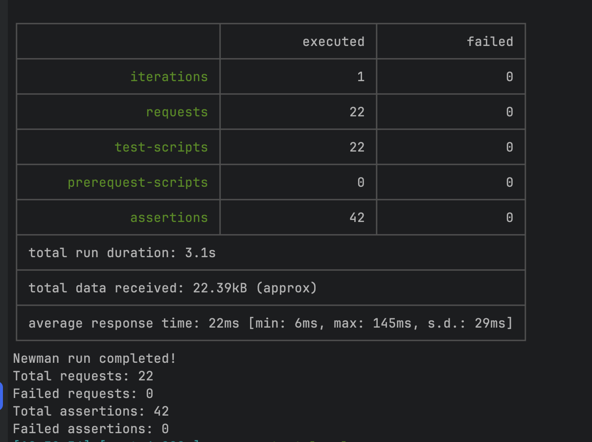

### Topics

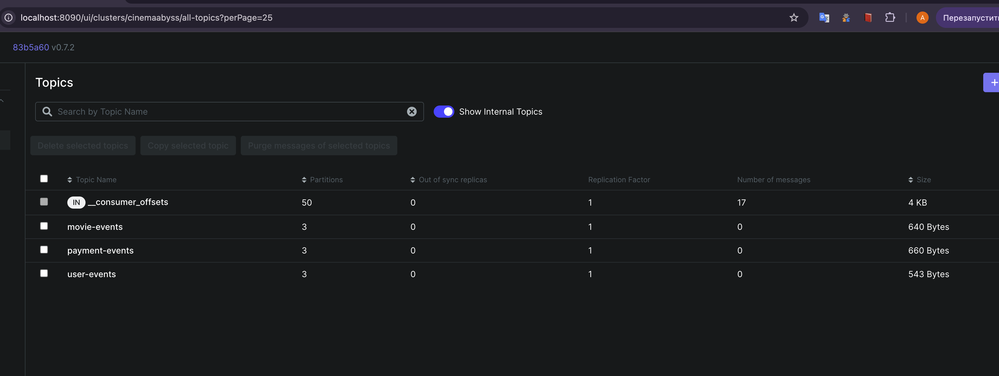

## Задание 3

Команда начала переезд в Kubernetes для лучшего масштабирования и повышения надежности. 
Вам, как архитектору осталось самое сложное:
 - реализовать CI/CD для сборки прокси сервиса
 - реализовать необходимые конфигурационные файлы для переключения трафика.

### CI/CD

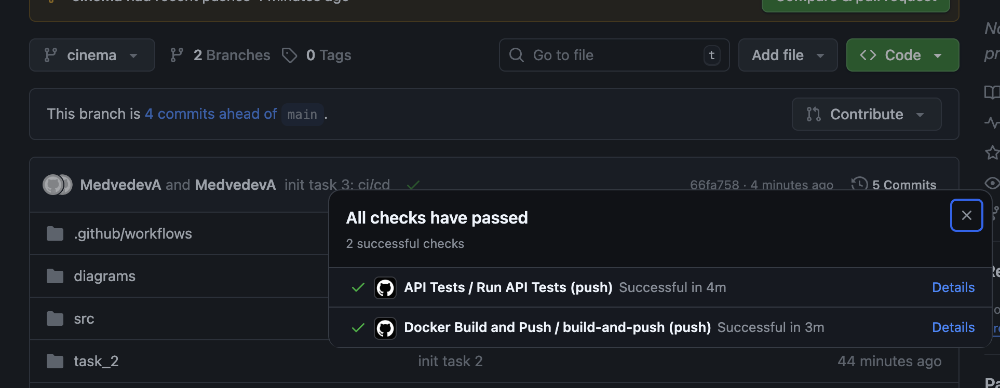

### Proxy в Kubernetes

#### Шаг 1

Настроил [dockerconfigsecret](src/kubernetes/dockerconfigsecret.yaml)

#### Шаг 2

Доработал [events-service](src/kubernetes/events-service.yaml), [movies-service](src/kubernetes/movies-service.yaml), [monolith](src/kubernetes/monolith.yaml) 

[Proxy-service](src/kubernetes/proxy-service.yaml) сделал иначе. Из-за особенностей настройки `kong.yml`, а именно - невозможности извне прокинуть энвы в этот конфиг, я решил настроить отдельно конфиг-мапу для конга. Образ я также тяну официальный конговский, настраиваю в деплойменте контейнеры с конговскими энвами, монтирую конфиг-мапу и всё работает.

#### Шаг 3

Скриншот вывода при вызове https://cinemaabyss.example.com/api/movies:

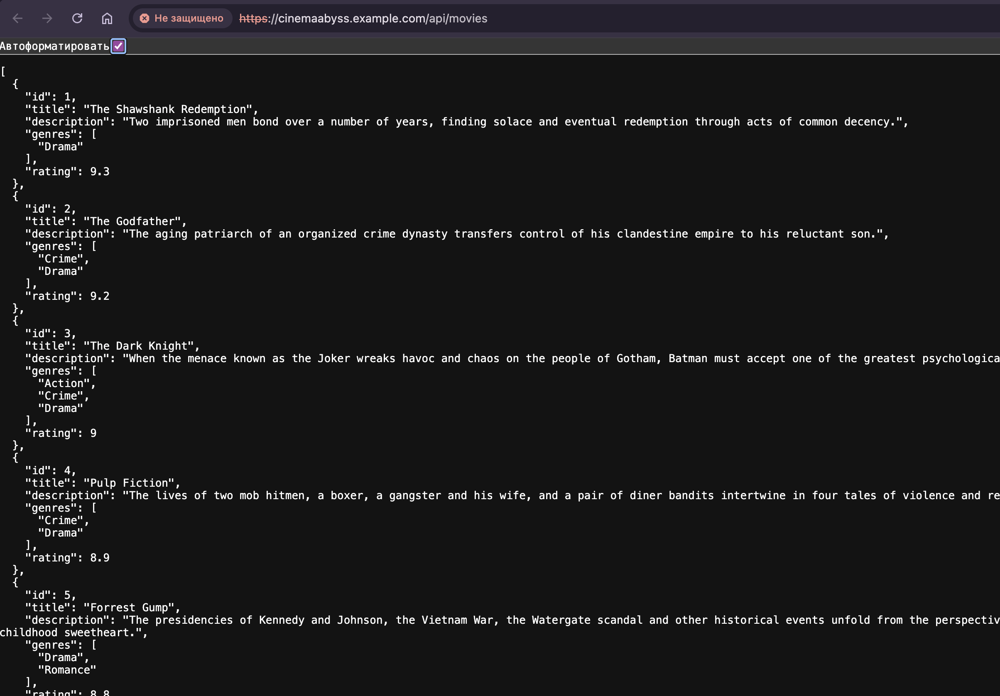

Скриншот тестов:

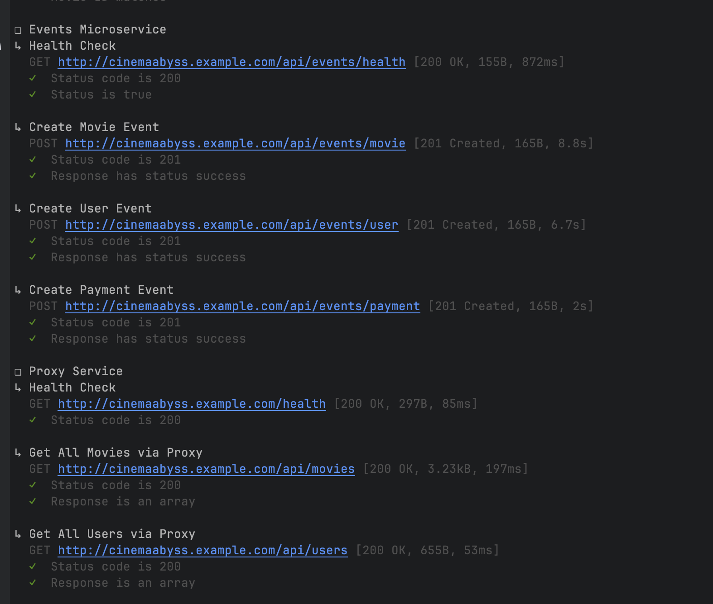

Скриншот вывода event-service логов после вызова тестов:

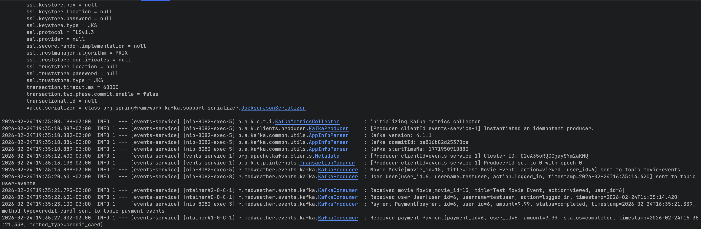

## Задание 4

Скриншот развертывания helm:

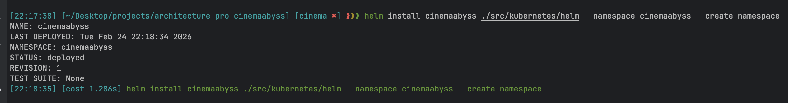

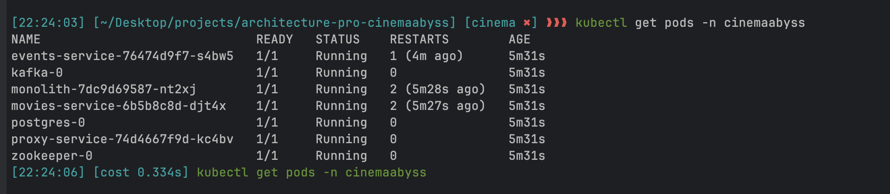

Скриншот вывода при вызове https://cinemaabyss.example.com/api/movies:

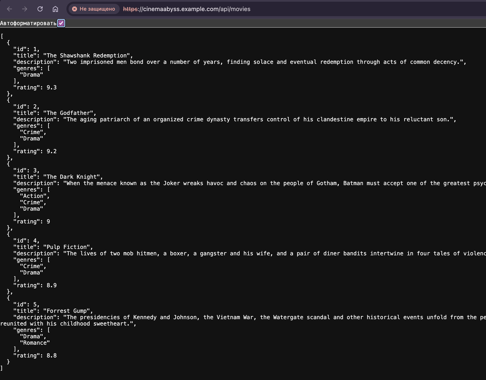

# Задание 5

Скриншоты работы circuit-breaker:

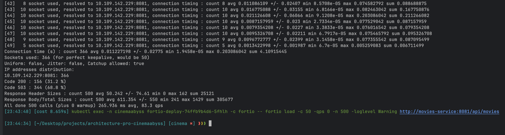

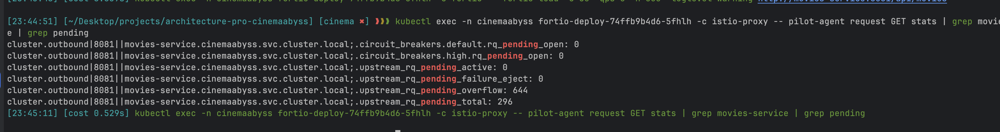
